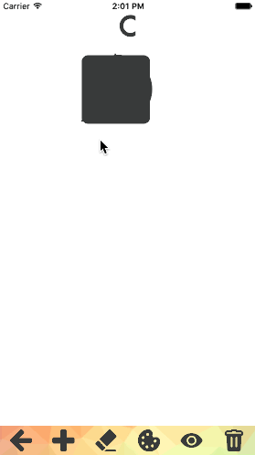

# P3-Colorer
CUAppDev Training Program Project #3 Fall 2015

Add shapes | Change color | Erase shapes
--- | --- | ---
 |  | 

Move shape | Resize shape | Rotate shape
--- | --- | ---
 |  | 

Layer shape |
--- |
 |

Hide or delete masterpiece | Share masterpiece
--- | --- 
 | 

**Toolbar**
- Swipe down on blank canvas to dismiss toolbar
- Swipe up on blank canvas to raise toolbar

Color mode | Draw mode
--- | --- 
.gif) | .gif)
