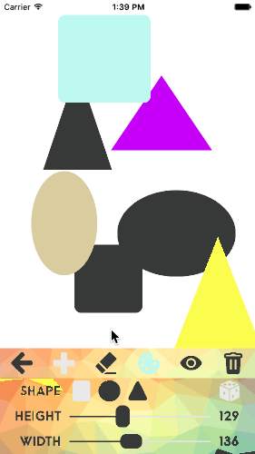

# P3-Colorer
CUAppDev Training Program Project #3 Fall 2015

Add shapes | Change color | Erase shapes
--- | --- | ---
 |  | 

[Swipe down to dismiss toolbar](Media/Example Gifs/dismissToolbar.gif)

[Swipe down to dismiss toolbar and swipe up to raise it](Media/Example Gifs/dimissToolbar2.gif)

[Hide or delete shapes](Media/Example Gifs/hideOrDeleteShapes.gif)

[Save masterpiece on phone or share to Facebook or Twitter](Media/Example Gifs/shareMasterpiece.gif)
